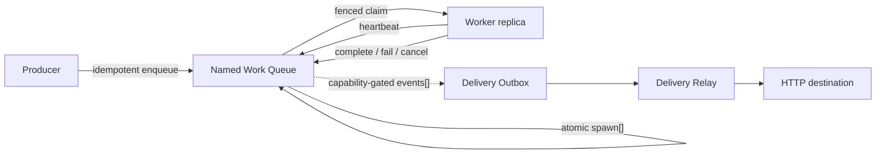

# Workhold - Durable work queue

**A durable Work Queue for applications that run across multiple replicas.**

Workhold (`queue-service`) gives application teams reliable background execution without
building queue correctness from scratch or adopting a shared platform-wide
message bus. It combines idempotent intake, fenced leases, retries, follow-up
tasks, and production operations behind a stable API.

- **Keep work through crashes:** a successful enqueue is committed to
  queue-service's PostgreSQL before it is acknowledged.
- **Scale workers safely:** replicas compete for tasks under fenced,
  renewable leases; stale workers cannot mutate queue state.
- **Finish work atomically:** completion and `spawn[]` follow-up tasks commit
  together, so the next step is not lost.

One versioned image is deployed beside each application with independent
`api`, `migrate`, `maintain`, `relay`, and `apply` roles. An application
business database is optional.

## Quick start

Run the service, migrations, and PostgreSQL locally with Docker:

```bash
git clone <repository-url>
cd queue
docker compose -f docker-compose.dev.yml up --build
```

The public API is available on `http://localhost:8080`. For host development,
Python 3.13 and [uv](https://docs.astral.sh/uv/) are required:

```bash
uv sync --group dev
uv run queue --help
uv run pytest
```

See the [local setup guide](docs/00-onboarding/02-local-setup.md) for
configuration, migrations, Docker profiles, and client development.

## Where next

| I want to… | Start here |
| --- | --- |
| Understand the product in 15 minutes | [Developer reading path](docs/00-onboarding/01-reading-path.md) |
| Integrate an application | [Integration guide](docs/02-guides/01-integrate-application.md) |
| See concrete workflows | [Examples](docs/08-examples/README.md) |
| Understand guarantees and failure behavior | [Guarantees](docs/01-concepts/09-guarantees.md) |
| Use the Python clients | [Client SDK guide](docs/02-guides/06-client-sdk-ergonomics.md) |
| Deploy and operate in production | [Operations](docs/05-operations/README.md) |
| Explore architecture and decisions | [Architecture and ADRs](docs/04-architecture/README.md) |
| Find a specific document | [Documentation index](docs/README.md) |

## Why Workhold?

Most applications eventually need more than "put a message in a list":

- multiple replicas must not successfully own the same lease;
- retries must be bounded, delayed, and explainable;
- a timeout must not turn an enqueue retry into duplicate work;
- completing one task and creating the next must not leave partial state;
- operators need pause, drain, inspection, dead-letter, and recovery tools;
- an application should not need a business database only to get a queue.

Workhold packages those concerns into a per-application reliability
boundary. It owns its PostgreSQL schema and operational state while the
application continues to own payload meaning and business results.

## What you get

### Durable intake

- Named queues inside one service instance
- Idempotent enqueue with request fingerprint validation
- Priority ordering and one-shot future scheduling
- Admission control before unsafe work reaches PostgreSQL

### Safe execution across replicas

- Atomic claim with a rotating secret token and lease generation
- Heartbeats for long-running handlers
- At-least-once recovery when a worker crashes or loses its lease
- Bounded long polling for efficient consumers
- Cooperative cancellation for already leased work

### Predictable failure handling

- Versioned retry policies per named queue
- Structured failure codes, delayed retries, and dead-letter state
- Idempotent terminal commands
- Attempt history and task lineage for diagnosis

### Atomic continuation

- `complete + spawn[]` in one database transaction
- Follow-up tasks can target other named queues
- No state where the source succeeds but accepted follow-up work disappears
- Delivery Outbox and relay infrastructure for outbound events; event creation
  remains capability-gated in the public completion API

### Production control

- Explicit queue creation and immutable policy versions
- Pause and drain modes
- Task, attempt, queue-depth, and dead-letter inspection
- Separate producer, worker, observer, admin, and break-glass access planes
- Migration, maintenance, retention, readiness, metrics, and audited recovery

## Common use cases

| Use case | How queue-service helps |
| --- | --- |
| **CPU- or I/O-heavy background jobs** | Distribute work across replicas, renew long leases, and safely retry after crashes |
| **Multi-stage processing** | Complete one task and atomically spawn the next stage into another named queue |
| **Scheduled work** | Make a task claimable at a bounded future `available_at` time without a promotion job |
| **Reliable handoff from a business transaction** | Use an app-local transactional outbox and deterministic idempotency key to bridge into queue-service |
| **Applications without a database** | Enqueue directly; queue-service already owns the durable store |
| **Controlled operational recovery** | Inspect attempts, diagnose failure codes, replay dead letters, and pause or drain queues |
| **Outbound notifications** | Record delivery intent in the Delivery Outbox and publish through the relay when the capability is enabled |

Explore the complete scenarios in
[Product use cases](docs/01-concepts/08-use-cases.md) and
[Examples](docs/08-examples/README.md).

## How it works



Workers process tasks **at least once**. If a lease is lost, another worker may
receive the task, so handlers and external effects must be idempotent. The
service does not claim exactly-once execution or distributed transactions with
an application's database. Read the
[guarantee matrix](docs/01-concepts/09-guarantees.md) before integrating.

## Python clients

Install only the role used by each process:

```bash
pip install queue-service-producer
pip install queue-service-consumer
pip install queue-service-admin
```

| Package | Purpose | Optional extras |
| --- | --- | --- |
| `queue-service-producer` | Enqueue, inspect, cancel, and bridge | `async`, `bridge-postgres` |
| `queue-service-consumer` | Claim, heartbeat, complete, fail, and supervise | `async` |
| `queue-service-admin` | Observe, administer, and run break-glass operations | `async` |

The packages share a coordinated version and depend on
`queue-service-client-core` for transport, errors, retries, and the public test
kit. OpenAPI 3.1 remains the authoritative wire contract.

## Roadmap

- [ ] **Kafka Delivery Relay adapter** — publish committed Delivery Outbox
  events to configured Kafka topics with stable event IDs, retry handling,
  observability, and CloudEvents-compatible envelopes.

Kafka will be an outbound transport after commit, not a second task queue or
source of truth for claims. The Work Queue lifecycle and fenced leases will
remain in queue-service and PostgreSQL. See
[ADR 018](docs/04-architecture/adr/018-http-first-delivery-relay.md).

## When to choose something else

Workhold is a Work Queue, not a universal messaging system.

| If you need… | Use… |
| --- | --- |
| Pub/sub, fan-out, or event-log replay | A message broker or event log |
| DAGs, joins, compensation, or human tasks | A workflow orchestrator |
| Exactly-once external effects | Application-level idempotency, inboxes, or natural uniqueness |
| A shared multi-tenant platform bus | A platform messaging service |

RabbitMQ or Kafka can complement queue-service as a downstream delivery
channel; they do not need to become a second claim/ack core. See
[Why Workhold](docs/01-concepts/02-why-queue.md) for the detailed
comparison.

## Repository structure

```text
.
├── src/queue_service/      # service runtime
├── packages/               # role-split Python clients
├── alembic/                # PostgreSQL migrations
├── openapi/                # OpenAPI 3.1 contract
├── tests/                  # unit, integration, conformance, and chaos tests
├── benchmarks/             # qualification workloads
├── docs/                   # concepts, guides, architecture, and operations
├── Dockerfile
├── docker-compose.dev.yml
└── pyproject.toml
```

## Contributing

Workhold is a personal project. Changes go through merge requests on the
repository remote. AI-assisted contributors should start with
[AGENTS.md](AGENTS.md).
