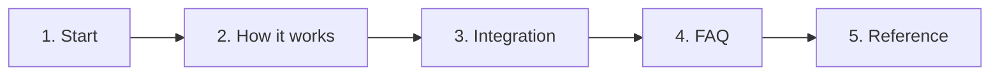

# Reading path (≈15 minutes)

[Documentation](../README.md) › Onboarding › **Reading path**

A short path for an application developer. Do not start from the ADR set — start with these five steps.

| Step | Time | Open | Why |
| --- | --- | --- | --- |
| 1. Start | ~3 min | [overview](../01-concepts/01-overview.md), [why-queue](../01-concepts/02-why-queue.md) | Why Workhold exists and how it differs from a broker |
| 2. How it works | ~5 min | [how-it-works](../01-concepts/03-how-it-works.md), [follow-up](../01-concepts/05-follow-up.md), [delivery outbox](../01-concepts/12-delivery-outbox.md) | Enqueue → claim → complete → `spawn[]` / `events[]` |
| 3. Integration | ~4 min | [integrate-application](../02-guides/01-integrate-application.md) | Direct API or app-local outbox bridge |
| 4. FAQ | as needed | [06-faq](../06-faq/README.md) | Common misconceptions: the answer, the mechanism, and what not to do, on one page |
| 5. Reference | by task | table below | Contracts, failures, scenarios |

## Start

Why Workhold is needed and who it is for — [overview](../01-concepts/01-overview.md).

Comparison with RabbitMQ and Kafka — [why-queue](../01-concepts/02-why-queue.md).

## How it works

End-to-end path of a task:

`enqueue` → `claim` → `heartbeat` → `complete` / `fail` / `cancel` → `spawn[]` / `events[]` → Delivery Relay

Page: [how-it-works](../01-concepts/03-how-it-works.md).

What follow-up / spawn is, on its own — [follow-up](../01-concepts/05-follow-up.md).

Who sends outbound HTTP and how to deliver to different services — [delivery outbox](../01-concepts/12-delivery-outbox.md).

## First integration

How to integrate an application:

| If the application has | Path |
| --- | --- |
| No business DB | enqueue to the API directly |
| A business DB | app-local outbox → bridge → idempotent enqueue |

How-to: [integrate-application](../02-guides/01-integrate-application.md).

## FAQ

Catalog [06-faq](../06-faq/README.md): one question, one page.
The answer, why it is so, and what not to do live in the file, with no required
jump to an ADR.

A production symptom — [07-troubleshooting](../07-troubleshooting/README.md):
what you see, why the service is built this way, and what to do step by step.

## Reference

Open normative details and contracts by task, not straight through.

| Need | Where |
| --- | --- |
| Schema tables/columns | [02-storage-contract](../03-reference/02-storage-contract.md) |
| Commands and env | [03-reference](../03-reference/01-commands.md) |
| State machines, storage, ADR | [04-architecture](../04-architecture/README.md) |
| Failures and symptoms | [07-troubleshooting](../07-troubleshooting/README.md) |
| Usage scenarios | [08-examples](../08-examples/README.md) |

---

← [Contents](../README.md) · [Local setup](02-local-setup.md) →
