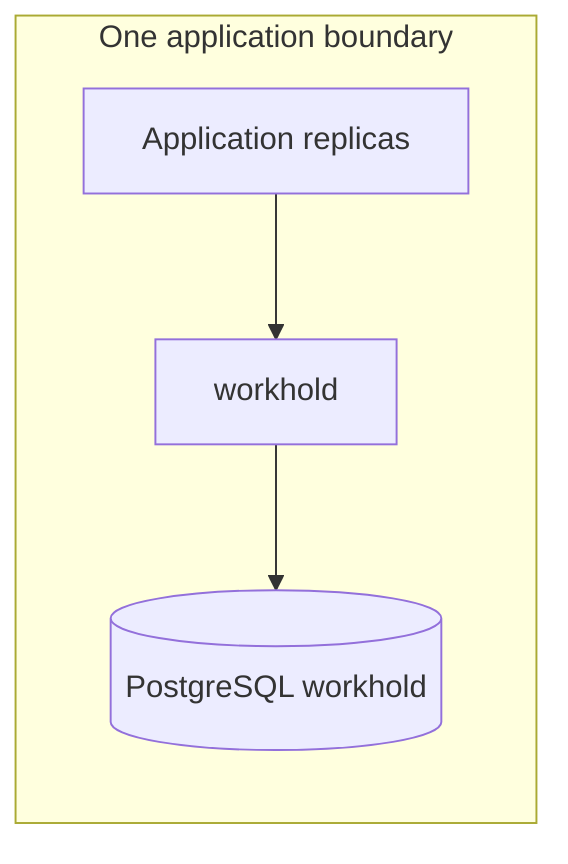
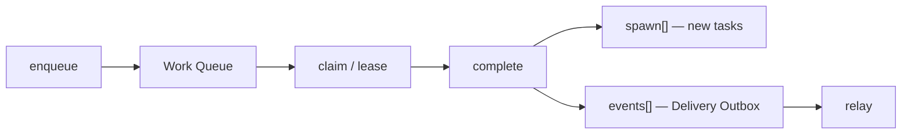

# Workhold - Durable work queue: why this service

[Documentation](../README.md) › [Concepts](README.md) › **Overview**

**Workhold - Durable work queue** (runtime: `workhold`). The same service is deployed beside every application that needs a reliable queue between replicas.

## Who needs it

Application teams: so they do not assemble a queue from scratch, write a separate queue service for every product, or introduce a business database only for the queue.

| | |
| --- | --- |
| Queue store | workhold's own PostgreSQL — required |
| Application business DB | Not required, and it does not appear "for the sake of the queue" |

The previous implementation worked only with file-parsers and carried their specifics. This repository is a rethink (conventionally v2): the queue should fit different kinds of applications.

## What problem it solves

An application has several replicas, and they need to share work. Someone enqueues a task, one live worker takes it, finishes it, and, when needed, immediately enqueues the next one.

The queue stands **beside this application**. It does not run as a shared bus for the whole platform.

| If you compare with… | There | Here |
| --- | --- | --- |
| Kafka | The same events go to many readers, log replay | **One** worker takes the work |
| RabbitMQ | A message lands in a queue and someone takes it | Closer, but the broker does not hold a fenced lease and cannot atomically `complete + spawn[] + events[]` |

If Kafka or RabbitMQ is still needed, they take an already prepared outbound delivery event — and they do not replace the work queue.

More detail is in [02-why-queue.md](02-why-queue.md).

## How it is delivered

Each application receives one versioned container image with process roles:

| Role | Why |
| --- | --- |
| `api` | Public and admin API |
| `migrate` | Schema migrations |
| `maintain` | Partitions, retention |
| `relay` | Delivery Outbox publication |

Containers run beside this application. The application may have one replica or several. This is not a shared bus for the whole platform.

On the transport it resembles a broker, but the product is a work queue with a lease, not a message bus.

## Base model

The product core is a durable Work Queue. The application enqueues tasks into named queues (`named queue` means separate task streams inside one instance, not separate services). Several replicas compete for a fenced `lease` (`claim`) and process tasks at-least-once.

What a named queue is — [04-named-queues.md](04-named-queues.md).

When the worker that owns the task does complete, it can:

| Field | What it creates | Where it lives |
| --- | --- | --- |
| `spawn[]` | Additional tasks | Named queues of the Work Queue. See [05-follow-up.md](05-follow-up.md) |
| `events[]` | Outbound events | Delivery Outbox, in the same transaction |

The Delivery Outbox follows the [transactional outbox](10-transactional-outbox.md) pattern: the workhold state change and the intent to deliver an event are committed together, and `relay` publishes it after commit. Downstream applies an [inbox](11-inbox.md) or another form of idempotency.

| The application | How to enqueue work |
| --- | --- |
| Has no business DB | Producer and worker call the API directly. Local outbox is not needed |
| Has a business DB | App-local outbox → the bridge enqueues the record into workhold again. There is no distributed transaction between the two databases |

Accepted boundaries and guarantees: [07-product-boundary.md](07-product-boundary.md), [09-guarantees.md](09-guarantees.md).

> **Not an implementation contract.** The old drafts [formats](../03-reference/03-formats.md), [storage](../03-reference/04-storage.md), and [HTTP](../03-reference/05-http-api.md) are not implementation contracts.

## Where next

1. End-to-end task lifecycle — [03-how-it-works.md](03-how-it-works.md).
2. Why workhold, not a broker — [02-why-queue.md](02-why-queue.md).
3. Reading path ≈15 minutes — [reading-path.md](../00-onboarding/01-reading-path.md).

---

← [Concepts](README.md) · [Why queue](02-why-queue.md) →
