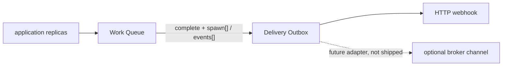

# Why Workhold, not a homegrown broker

[Documentation](../README.md) › [Concepts](README.md) › **Why queue**

A short page for the application developer: why to take Workhold (`queue-service`), how the service differs from RabbitMQ and Kafka, and when the tools complement each other.

## Why Workhold for developers

A durable Work Queue is needed between competing replicas of the application.

**Named queue** — a named task stream inside one instance, not a separate service. The producer writes to a specific name (for example `orders`); the worker takes only the queues it can process. More detail — [04-named-queues.md](04-named-queues.md).

| What it provides | How |
| --- | --- |
| Idempotent enqueue | Into the chosen named queue, without a required business DB on the application |
| Fenced claim / lease | Heartbeat and at-least-once processing |
| Atomic complete | `spawn[]` follow-up tasks (see [05-follow-up.md](05-follow-up.md)) and `events[]` in the Delivery Outbox |
| Operations | Task inspection, pause/drain, operational statistics |
| Deploy boundary | Without a shared platform bus for the whole platform |

Envelope: up to 1 million tasks/day and hundreds of claims/s per instance.

## What Workhold is not

| It is not | Meaning |
| --- | --- |
| Not RabbitMQ and not Kafka | A different model: Work Queue + Delivery Outbox |
| Not pub/sub | No consumer groups and no event-log replay |
| Not a workflow/DAG orchestrator | No join, compensation, human task |
| Not a store of business results | Operational outcome only |
| Not a shared multi-tenant bus | One instance — one application boundary |

## Comparison with RabbitMQ and Kafka

| | queue-service | RabbitMQ | Kafka |
| --- | --- | --- | --- |
| Model | per-app Work Queue + Delivery Outbox | message broker | event log |
| Fenced leases | yes | competing consumers without a core fenced lease | consumer groups / offsets |
| Idempotent enqueue | yes | usually the application | usually the application |
| Atomic complete + `spawn[]` + `events[]` | yes | not in one store | not as a task kernel |
| Pub/sub and replay | explicit non-goal | pub/sub | replay / log |
| Task history / inspection | operational outcome | by the broker | by the log |
| Deploy | per-application | often shared | often shared |
| First delivery adapter | HTTP webhook | — | — |

## When they complement each other

queue-service owns enqueue / claim / lease / complete / `spawn[]` / Delivery Outbox.

A broker (if one is needed) carries already committed delivery events as a channel **after** commit — not a second claim/ack core.

| Now | Later |
| --- | --- |
| The first shipped adapter is an HTTP webhook | Broker adapters may appear (ADR 018); they are not shipped now |

## When Workhold is not needed

Do not place two claim/ack cores side by side (queue-service and a broker "as a task queue").

| You only need… | Take |
| --- | --- |
| Pub/sub or event-log replay without a Work Queue | A broker / log directly |
| A DAG / workflow | Another product |

Next: [07-product-boundary.md](07-product-boundary.md), [09-guarantees.md](09-guarantees.md), [018-http-first-delivery-relay.md](../04-architecture/adr/018-http-first-delivery-relay.md).

---

← [Overview](01-overview.md) · [How it works](03-how-it-works.md) →
