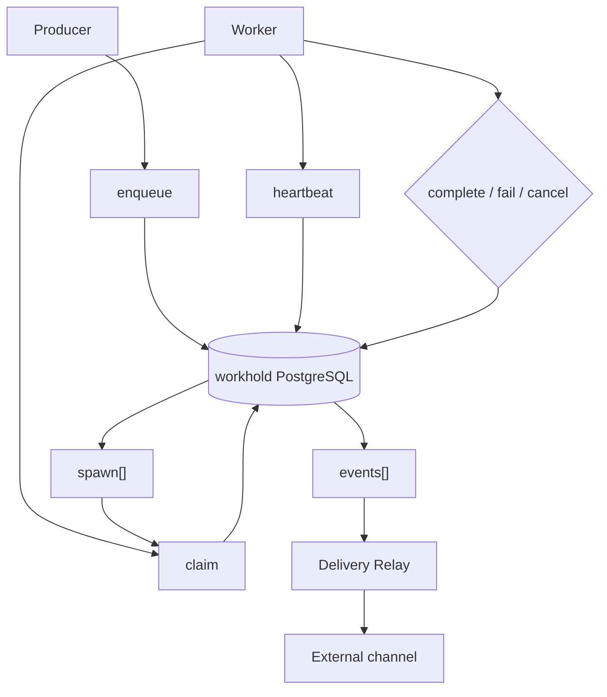

# How it works

[Documentation](../README.md) › [Concepts](README.md) › **How it works**

The short path of a task from enqueue to external delivery. No ADRs and no HTTP catalog: it is enough to understand the roles of producer, worker, workhold API, workhold PostgreSQL, and Delivery Relay.

> **Execution guarantee — at-least-once.** After a `lease` is lost, another worker may take the task, and the Delivery Relay may publish the event again. workhold does not promise Exactly-once external effects — idempotency stays with the application and the consumers.

| Step | Who | What is recorded |
| --- | --- | --- |
| 1. Enqueue | Producer | Task in workhold PostgreSQL |
| 2. Claim | Worker | Fenced lease: one active claim |
| 3. Heartbeat | Worker | Lease extension |
| 4. Complete / fail / cancel | Worker or producer | Terminal outcome |
| 5. `spawn[]` / `events[]` | On complete | New tasks and/or Delivery Outbox |
| 6. Delivery Relay | `relay` role | Publication to the external channel |

## 1. Enqueue

The producer chooses a named queue (the name of a task stream inside the instance, which an admin has already created) and a stable idempotency key, and passes an opaque payload. workhold checks limits and the request fingerprint, writes the task to its store, and reports success only after commit.

What a named queue is — [04-named-queues.md](04-named-queues.md).

| Repeat | Result |
| --- | --- |
| Same key and same body | Returns the original task |
| Same key with a different body | Rejected |
| Unknown queue name | Error: enqueue does not create a queue "on a typo" |

workhold already has its own PostgreSQL. An application without a business DB does not get a separate client database for the queue: the producer calls the API directly. If the application has a business DB, the app-local outbox and the bridge perform the same enqueue, repeatably, after the application commit.

## 2. Claim

The worker requests work from the queues it can process. workhold atomically selects a claimable task and issues a fenced `lease`: one active claim per task, with `claimed_at` and `worker_id` for diagnostics.

Several replicas compete for the same tasks. A worker that crashes or drops off the network loses the lease; another replica can make a new claim. The old token no longer moves workhold state.

## 3. Heartbeat

For long work, the worker extends the lease with a heartbeat before it expires. An expired or superseded claim is rejected: heartbeat, complete, and fail from a foreign or stale token do not pass.

While the worker holds the lease, the business effect runs outside workhold transactions. The handler must therefore be idempotent: at-least-once allows a repeat after the lease is lost.

## 4. Complete, fail, cancel

Three outcomes after claim:

| Outcome | What happens |
| --- | --- |
| **complete** | The task finished successfully |
| **fail** | The worker reports a machine-readable `failure_code`. workhold writes the attempt and, by the named queue policy, either delays a retry or moves the task to dead letter |
| **cancel** | The producer requested cancellation. A delayed/ready task becomes terminal immediately. A leased task is shown to the worker on heartbeat; the current claim confirms cancellation with an idempotent `ack_cancel` (or lease expiry finalizes the pending cancel) |

A repeat of the same terminal command with the same claim and the same body returns the original result, without duplicates.

## 5. spawn[] and events[]

On a successful complete, in one workhold transaction:

1. the original task → succeeded;
2. `spawn[]` → new tasks in the target named queues (immediately part of the Work Queue);
3. `events[]` → pending Delivery Outbox records (an intent to deliver, not a publication).

| Resource | Where it lives | When it is visible outside |
| --- | --- | --- |
| `spawn[]` | Work Queue | Immediately, as ordinary tasks |
| `events[]` | Delivery Outbox | After commit; the relay publishes them |

What a follow-up is — [05-follow-up.md](05-follow-up.md).

## 6. Delivery Relay

The `relay` role takes pending events under its own lease, publishes a stable event ID to the external channel, and records the acknowledgement. An indeterminate or retryable outcome is repeated with backoff; an exhausted one becomes a delivery dead letter.

Publication is at-least-once: if publish succeeded and the ack was lost, the event may go out again. Downstream keeps an inbox, or an equivalent, keyed by the stable ID.

The first Delivery Relay adapter is an HTTP webhook (allowlist, timeout, classification, backoff, circuit breaker). A broker as a delivery channel is a future option and does not change the Work Queue model.

Who sends HTTP, what is in CloudEvents, and how to separate services X and Y — [12-delivery-outbox.md](12-delivery-outbox.md).

## Where next

- Delivery Outbox and the contract: [12-delivery-outbox.md](12-delivery-outbox.md).
- Why workhold sits beside brokers — [02-why-queue.md](02-why-queue.md).
- Boundaries and guarantees — [07-product-boundary.md](07-product-boundary.md), [09-guarantees.md](09-guarantees.md).
- Reading path — [reading-path.md](../00-onboarding/01-reading-path.md).

---

← [Why queue](02-why-queue.md) · [Named queues](04-named-queues.md) →
