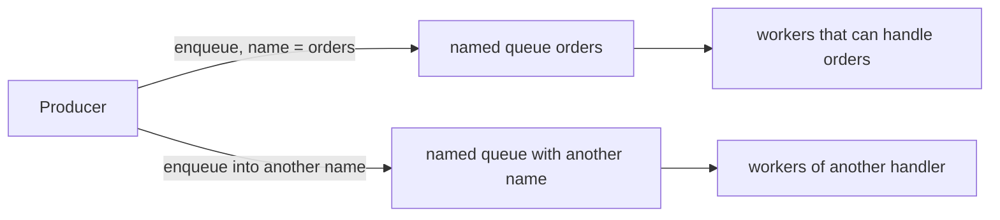

# Named queue — what it is

[Documentation](../README.md) › [Concepts](README.md) › **Named queues**

A **named queue** is a named task stream inside one queue-service instance. It is not the whole service and not a separate deploy: one application has one instance, and inside that instance there are several queues with different names.

The producer enqueues a task under a specific name. The worker requests a claim only from the queues it can process. The name is explicit routing; queue-service does not parse the payload.

Example from the [admin guide](../02-guides/04-admin-queues.md): an admin creates the `orders` queue. The producer then says "enqueue work into `orders`". A worker that processes only another kind of task does not name this queue — and does not receive someone else's task.

## Why several names, not one queue

An application can have different kinds of work and different worker pools.

| If you… | The result |
| --- | --- |
| Route by a field inside the payload | A worker that cannot handle the task may take someone else's task |
| Run a separate instance for each kind | PostgreSQL and operations multiply |
| Put routing in the queue name | Each queue has its own retry policy and runtime state |

Each named queue has its own retry policy and runtime state:

| State | Meaning |
| --- | --- |
| `active` | Normal mode |
| `paused` | Enqueue is allowed, claim is not |
| `draining` | External enqueue is not allowed; claim and internal spawn continue |

The idempotency key is scoped by producer, queue name, and key.

An admin creates the queue explicitly. Enqueue of an unknown name is an error, not a silent new queue.

## What a named queue is not

- not the whole queue-service and not "the platform queue";
- not a Kafka topic and not pub/sub: one task is processed by one logical worker, with possible at-least-once redelivery;
- not a separate instance and not its own database per name;
- not something that appears by itself on the first enqueue.

More on boundaries and guarantees: [07-product-boundary.md](07-product-boundary.md), [09-guarantees.md](09-guarantees.md). The decision "several names in one instance" — [ADR 002](../04-architecture/adr/002-named-queues-per-instance.md). Creating a queue — [admin-queues.md](../02-guides/04-admin-queues.md). A short FAQ answer: [What is a named queue?](../06-faq/03-what-is-named-queue.md).

---

← [How it works](03-how-it-works.md) · [Follow-up](05-follow-up.md) →
