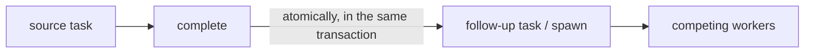
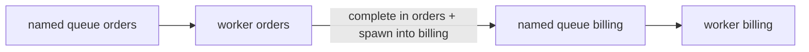

# Follow-up — what it is

[Documentation](../README.md) › [Concepts](README.md) › **Follow-up**

A **follow-up** (in the API — **spawn**) is a new independent Work Queue task that a worker can create at the same moment it successfully finishes the current task.

In conversation this is often called "a subtask created when the parent is closed". The sense is close; the model is different: on complete the original task already becomes succeeded, and the follow-up immediately lives on its own. Any worker of the target [named queue](04-named-queues.md) claims it as ordinary work.

## How it works

1. The worker holds a lease on the original (**source**) task.
2. On a successful complete it passes `spawn[]` — zero or more new tasks into the target named queues.
3. In one workhold transaction: the original task → succeeded, and the follow-ups appear in the Work Queue.
4. There is no window in which "the original is closed and the next work is lost".
5. A repeat of the same complete with the same claim and the same body returns the same spawned tasks, without duplicates.

The source → spawn link exists as lineage (who spawned whom). It is not an ownership tree and not a wait for children.

## Example: complete in one queue, the task in another

One instance has several [named queues](04-named-queues.md). Each has its own work stream and its own workers. A complete in one queue can atomically enqueue a new task into **another**.

Suppose an admin has already created two queues: `orders` and `billing`.

| Step | Where | What happens |
| --- | --- | --- |
| 1 | `orders` | A worker processes order `42` |
| 2 | `orders` | Finishes this task |
| 3 | the same complete | Passes `spawn[]` with `queue_name: billing` |
| 4 | both queues | The task in `orders` → succeeded; an independent task "issue an invoice for order 42" appears in `billing` |
| 5 | `billing` | A `billing` worker takes it. The `orders` queue no longer holds this work |

You can also spawn several tasks, into different names. The target queue must already exist: an unknown name is an error, as with an ordinary enqueue. The step-by-step scenario is [complete-and-spawn.md](../08-examples/03-complete-and-spawn.md).

## How to say it correctly

| Colloquially | In the product |
| --- | --- |
| parent | source / source task |
| subtask | follow-up task / spawn |
| create when closing the parent | atomically spawn on complete |

A "subtask" in a tracker lives inside the parent and often does not release it. A follow-up in workhold is the **next independent unit of work**, enqueued atomically together with complete.

## What a follow-up is not

- not a nested tracker subtask: there is no parent/child hierarchy and no "wait for all children";
- not a Delivery Outbox record — that is `events[]`;
- not a workflow/DAG, join, compensation, or human task;
- not a required step: complete without `spawn[]` is normal.

## Where next

- An example in the scenario catalog: [complete-and-spawn.md](../08-examples/03-complete-and-spawn.md).
- Scenario: [UC-3](08-use-cases.md#uc-3-a-successful-worker-spawns-more-work).
- End-to-end lifecycle: [03-how-it-works.md](03-how-it-works.md).
- How spawn differs from an event: [spawn-vs-events.md](../06-faq/09-spawn-vs-events.md).
- When to call services X and Y as work, not as events: [12-delivery-outbox.md](12-delivery-outbox.md).
- Why this is not an orchestrator: [workflow-dag.md](../06-faq/07-workflow-dag.md).
- The "two different resources" decision: [ADR 003](../04-architecture/adr/003-separate-spawns-and-events.md).

---

← [Named queues](04-named-queues.md) · [Glossary](06-glossary.md) →
