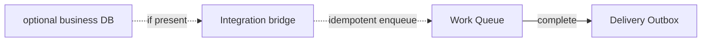

# Product boundary

[Documentation](../README.md) › [Concepts](README.md) › **Product boundary**

**Workhold** (`queue-service`) is a reliability service for one application — product name: **Workhold - Durable work queue**. It distributes work among replicas and accepts the intent of outbound delivery. Data lives in the service's own PostgreSQL. The application may have its own business database or do without one — the queue does not depend on that.

## What the product promises

The operator runs queue-service PostgreSQL and the service runtime itself. A business database on the application is not required. Producer and worker replicas then call a stable API:

- they idempotently enqueue work into named queues — separate task streams inside one instance; see [04-named-queues.md](04-named-queues.md);
- they safely take tasks among competing replicas;
- they record when and which worker took each task;
- they extend the lease, retry processing, record a failure, cancel enqueued work, and cooperatively release a task that was already taken;
- they keep scheduling (`priority`, `available_at`) in task metadata, not inside the payload;
- they configure a bounded retry policy on the named queue and write structured failures;
- they atomically create the next work (see [05-follow-up.md](05-follow-up.md)) and record outbound events;
- they read operational statistics without direct database access.

## Three surfaces

### Work Queue

Owns named queues, tasks, attempts, and leases. One task is intended for one logical handler. Several workers compete for the same tasks; if the lease has expired, the task can be issued again.

### Delivery Outbox

Owns outbound events. They are written in the same queue-service transaction as the successful completion of the task. The Delivery Relay publishes them after commit to one webhook of the deploy. Events and spawned tasks are different resources with different lifetime rules. Who sends HTTP and how to separate two recipients — [12-delivery-outbox.md](12-delivery-outbox.md).

### Integration bridge

An optional integration for an application with a business database. The application writes a local outbox in its business transaction; the bridge repeats an idempotent enqueue into queue-service. An application without a database does not need the bridge.

## Who owns what

| What | Who owns it |
| --- | --- |
| queue-service DDL and migrations | queue-service runtime |
| Task state and lease | Work Queue |
| Payload schema and business meaning | the application |
| Delivery retry and publication state | Delivery Outbox |
| Atomicity of "business database + task enqueue" | the application's local outbox |
| An idempotent external effect | the effect owner / consumer |
| Operations and retention | the queue-service operator |

Applications do not need direct access to queue-service tables. If the client queries the database itself, the application is bound to the schema again — as in parser queue v1.

## Deploy boundary

- One queue-service instance serves one application trust boundary.
- One versioned image exposes process roles that can be deployed independently.
- One instance can contain several named queues.
- API and relay processes can have several replicas on one queue-service store.
- queue-service always has its own PostgreSQL. This is not the client's business database and not queue tables inside the application database. A dedicated physical PostgreSQL server is not required: the service database can sit on a shared cluster, but ownership, DDL, and migrations stay with queue-service.
- queue-service is not a shared bus for the whole platform and not a multi-tenant bus for several applications.

## What is in the product

- Competing consumers and correctness with several replicas.
- Idempotent enqueue and idempotent task completion.
- Lease, attempts, retry with backoff, and dead letter.
- Atomic `complete + spawn + events` in the queue-service store.
- Delivery Relay with at-least-once publication.
- Statistics, metrics, retention, and operational control.
- Pause and drain at runtime, admission control, task inspection, and auditable recovery.
- Separate access planes for producer, worker, and closed admin.
- A bridge from the application's local outbox — the supported way to integrate with a business database.

## What is not in the product

- Exactly-once execution at the worker or of external effects.
- Distributed transactions between queue-service PostgreSQL and the application database.
- Pub/sub, fan-out, event-log replay, or consumer groups.
- Workflow and DAG orchestration, joins, compensation, or human tasks.
- Application payload validation or a schema registry.
- Storage and search of the application's business results.
- Fields for a specific parser such as `minio_path`, `file_id`, or `job_kind`.
- A required database on the application.

## How this is delivered in stages

The product boundary is already stable. Capabilities may ship in steps:

| Stage | What appears |
| --- | --- |
| 1 | Work Queue core: named queues and a fenced lease |
| 2 | Retries, dead letter, retention, and observability |
| 3 | Delivery Outbox and relay — after the transport decision |
| 4 | A supported bridge from the application's local outbox |

The first implementation therefore does not immediately become a queue, a broker, and an integration platform at once, leaving no room for incompatible contracts.

---

← [Glossary](06-glossary.md) · [Use cases](08-use-cases.md) →
