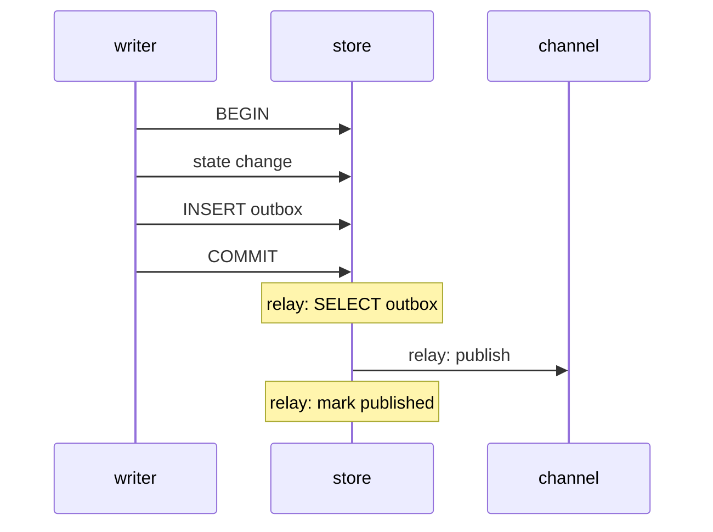

# Transactional outbox

[Documentation](../README.md) › [Concepts](README.md) › **Transactional outbox**

A reliable-publication pattern: the event is saved in the same transaction as the state change, and only then sent to an external channel (a broker, HTTP, another service).

The base pattern of this service. How it maps onto workhold is at the end. The table schema and a specific broker are not defined here.

## What problem it solves

Two separate writes cannot be made atomic:

1. change state (a row in the DB, a task status);
2. send a message to the broker.

| If… | The result |
| --- | --- |
| The commit succeeded and publication failed | The event is lost |
| Publication succeeded and the commit rolled back | The consumer has an event that "did not happen" |

This is dual-write.

## How it is structured

In the same store where the change is recorded, a neighboring outbox table is introduced.

In one transaction:

1. apply the business change;
2. insert an outbox row (what to deliver, where, the idempotency key).

After commit, a separate process (the relay / publisher) reads new outbox rows and publishes them to the external channel. Successful ones are marked delivered (or deleted). Failed ones are left and retried.

The relay can live outside the application. The writer needs one thing: do not treat the message as "sent" until it is in the outbox in the same transaction as the change.

## What it provides and what it does not

| Provides | Does not provide |
| --- | --- |
| The change and the "intent to deliver" either both exist or neither does | Exactly-once delivery to the consumer (at-least-once to the channel: the relay may have published and crashed before the mark) |
| A retry after a relay failure — the message is not lost because the publisher crashed | Idempotency on the consumer side — that is the [inbox](11-inbox.md) |
| | The choice of broker and the shape of the record |

## In workhold

The Delivery Outbox lives in the **workhold** store next to task state. On complete, the original task and outbound events are recorded in one workhold transaction; a separate delivery relay publishes events after commit.

New follow-up tasks (`spawn[]`) can also be created in the complete transaction, but they are Work Queue entities, not outbox records. This split is recorded in [ADR 003](../04-architecture/adr/003-separate-spawns-and-events.md).

| The application | How |
| --- | --- |
| Has no DB of its own | Enqueue directly. workhold guarantees atomicity of its own records, but not of business state that does not exist |
| Has a business DB | App-local outbox and a bridge to idempotent enqueue. The business change and the intent are atomic in the app DB; delivery into workhold is eventual. See [ADR 004](../04-architecture/adr/004-app-local-outbox-bridge.md) |

How the Delivery Outbox is structured in the product, who sends HTTP, and how to separate two recipients — [12-delivery-outbox.md](12-delivery-outbox.md).

Next: [inbox](11-inbox.md), [delivery outbox](12-delivery-outbox.md), [service overview](01-overview.md).

---

← [Guarantees](09-guarantees.md) · [Inbox](11-inbox.md) · [Delivery Outbox](12-delivery-outbox.md) →
