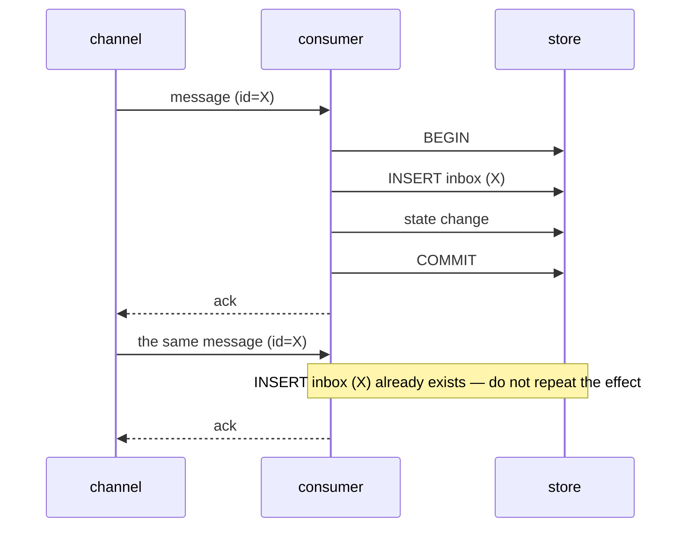

# Inbox

[Documentation](../README.md) › [Concepts](README.md) › **Inbox**

A reliable-reception pattern: in one transaction the consumer records "I have already seen this message" and its own state change. A repeat delivery of the same message is not applied a second time.

It is the pair of the [transactional outbox](10-transactional-outbox.md). The table schema and the storage location in queue-service are not fixed.

## What problem it solves

A channel (a broker, an outbox relay, HTTP) usually gives **at-least-once**: the same message can arrive twice — the relay published and crashed before the mark, the broker redelivered, or the consumer finished and did not acknowledge.

If the consumer changes state from scratch every time, there is a repeated effect: a double charge, a second task, a repeated callback.

The inbox answers the question: "have I already processed this message?"

## How it is structured

In the consumer's store (classically, its DB) an inbox table is introduced. The key is a stable message identifier (an id from the broker, an idempotency key from the outbox).

In one transaction:

1. insert an inbox row with this id;
2. apply the business effect.

If the id is already present, the insert fails (unique) — the transaction is rolled back or the effect is skipped. The message is acknowledged to the channel as processed.

The writer and the outbox do not know about "already processed". That is the consumer's responsibility (or of the layer that accepts on its behalf).

## What it provides and what it does not

| Provides | Does not provide |
| --- | --- |
| A repeat delivery does not repeat the effect, if the id is stable and the check is in the same transaction as the effect | Exactly-once in the broker as such — idempotency is on reception |
| Together with the outbox it closes the loop: do not lose on publication and do not apply twice on reception | Work without a stable message id |
| | The choice of where the table lives |

## In queue-service

Here the inbox is described as an integrator pattern, not as a table in queue-service.

The inbox lives with the owner of the external side effect, so that the "already processed" record can be atomic with the effect itself. If the application has no DB, the handler uses a naturally idempotent operation or an idempotency/CAS mechanism of the external store. queue-service cannot centrally make someone else's side effect exactly-once.

Do not carry the inbox over from parser queue v1 as a specification.

Next: [transactional outbox](10-transactional-outbox.md), [delivery outbox](12-delivery-outbox.md), [service overview](01-overview.md).

---

← [Transactional outbox](10-transactional-outbox.md) · [Delivery Outbox](12-delivery-outbox.md) →
