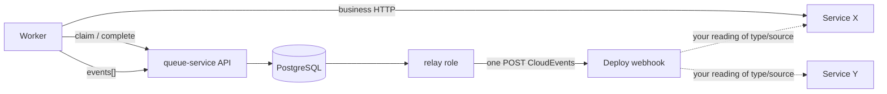

# Delivery Outbox and Relay

[Documentation](../README.md) › [Concepts](README.md) › **Delivery Outbox**

The Delivery Outbox is a log of outbound notifications in queue-service PostgreSQL.
The `relay` role of the same image publishes them after commit. This is not execution
of business work and not an address book of "this service this way, that service another way".

The "write first, then the channel" pattern is in [10-transactional-outbox.md](10-transactional-outbox.md).
How an event differs from a follow-up task is in [05-follow-up.md](05-follow-up.md) and
[FAQ spawn vs events](../06-faq/09-spawn-vs-events.md).

## Who makes which HTTP call

Three different calls. They are easy to mix up.

| Who | Where | Why |
| --- | --- | --- |
| Producer / worker | queue-service API | enqueue, claim, heartbeat, complete |
| The application worker | another service, MinIO, its own DB | **business work** for the task |
| The `relay` role | one deploy webhook | a **notification** from the Delivery Outbox |

The queue does not call arbitrary services in order to do the task's work.
While the worker holds the lease, the external effect is the worker's. `relay` is not needed if
nobody has to be notified: complete without `events[]` is normal.

There is no need to write a separate application to "take the outbox and publish it".
The `relay` process of the same image publishes: `api` + `relay` (+ `migrate` /
`maintain`). Another process is needed only for the [app-local outbox](10-transactional-outbox.md):
a bridge from the business DB **into** enqueue, not outward.



The dotted line on the right is not queue-service. The relay always hits one configured
endpoint. Only that endpoint, or your workers, can separate X and Y.

## How the events[] path is structured

1. The worker successfully processes the claimed task.
2. On `complete` it passes zero or more `events[]` — an **intent** to deliver,
   not a publication.
3. In one queue-service transaction: the task → succeeded, Outbox records → pending.
4. After commit, `relay` claims the pending event under its own lease.
5. `relay` publishes a stable envelope to the external channel and writes the ack.
6. A retryable / indeterminate outcome is repeated with backoff. An exhausted one
   becomes a delivery dead letter.

Publication is **at-least-once**: publish may have succeeded and the ack been lost — the same
event goes out again. The consumer keeps an [inbox](11-inbox.md) keyed by the stable
`id` that queue-service assigns.

## Contract: what, where, how

The delivery format is [CloudEvents 1.0](https://github.com/cloudevents/spec/blob/v1.0.2/cloudevents/spec.md)
JSON structured mode (`application/cloudevents+json`). Decision:
[ADR 021](../04-architecture/adr/021-cloudevents-envelope.md).
Transport: [ADR 018](../04-architecture/adr/018-http-first-delivery-relay.md).

### What — the event body

| Field | Who sets it | Meaning |
| --- | --- | --- |
| `source`, `type` | the application | who emitted it and what kind of event it is |
| `subject`, `datacontenttype`, `data`, `extensions` | the application, optionally | the subject and the payload |
| `id`, `time`, `specversion` | queue-service | a stable id for the inbox, store time, `1.0` |

`type` and `source` are routing of **meaning** ("the order was paid"), not a URL.
`data` is the application's opaque JSON. queue-service does not read an address,
a header, or a secret from it.

### Where and how — the relay deploy

One webhook per instance. The operator sets it, not the worker and not the event contents.

| Question | Who answers | Typical |
| --- | --- | --- |
| Where to send | the deploy | `QUEUE_DELIVERY_WEBHOOK_URL` + a host and CIDR allowlist |
| How to send | the deploy | `POST`, HTTPS in production, timeout, bearer, TLS, circuit breaker |
| What is in the body | the worker + queue-service | a CloudEvents envelope |

A URL cannot be chosen from `data`. Otherwise the task itself would say where to hit
(SSRF). An event is not an envelope with the recipient's address.

## One event to service X, another to Y

The relay does **not** send one event to X and another to Y. Both go to one webhook.
How to separate recipients depends on whether these are notifications or work.

### These are notifications: "X and Y must learn about it"

Put both events in `events[]` with a **different** `type` (and, if needed,
`source` / `subject` / `data`). Each gets its own `id` from queue-service —
the inbox at X and the inbox at Y are independent.

```text
complete
  events:
    - type: com.app.order.billed      → meaning for billing
    - type: com.app.order.notified    → meaning for the notifier
                 ↓
relay POSTs both to https://sink.example/hooks/queue
                 ↓
the sink reads type and itself calls X and/or Y
```

The webhook is your thin sink / API gateway. It is not part of the queue image.
It is the piece that knows `com.app.order.billed` goes to X and
`com.app.order.notified` goes to Y.

One event and a sink fan-out to both services is worse if X and Y must
deduplicate differently: they would share the same `id`.

Two queue-service deploys "so that each has its own webhook" are not a solution
for one application: an instance belongs to one trust boundary.

### This is work: "X must be called and Y must be called"

Do not use the Delivery Outbox as an HTTP proxy.

| Need | How |
| --- | --- |
| The current worker calls X and Y itself | business HTTP inside the lease; complete without `events[]`, or with a notification only |
| The calls must survive this worker crashing | `spawn[]` into named queues whose workers call X and Y |

Follow-up tasks are ordinary Work Queue work; competing workers claim them.
See [05-follow-up.md](05-follow-up.md) and
the [spawn example](../08-examples/03-complete-and-spawn.md).

```text
complete
  spawn:
    - queue_name: call-x
    - queue_name: call-y
                 ↓
call-x queue worker ──HTTP──► service X
call-y queue worker ──HTTP──► service Y
```

They can be mixed: `spawn[]` is work, `events[]` is a notification after the same
complete. They are different resources in one transaction.

## What the contract does not include

- "url / host / header" fields on the event.
- Several webhooks on one instance and routing by contents.
- Exactly-once to X or Y. A repeat is normal; the consumer has an inbox.
- A required broker. The first adapter is an HTTP webhook; another transport
  does not change the Work Queue model and does not add a per-event address.

Public HTTP complete does not accept `events[]` yet: capability
`delivery_events` = false, and the key is reserved. The model and the `relay` role already
exist; enabling the field in the API is a separate protocol step. An empty complete without
events is the current normal path.

## Where next

- End-to-end lifecycle: [03-how-it-works.md](03-how-it-works.md).
- Who sends outbound HTTP: [FAQ](../06-faq/14-who-sends-outbound-http.md).
- X and Y in one complete: [FAQ](../06-faq/15-events-to-two-services.md).
- Scenario: [UC-4](08-use-cases.md#uc-4-a-successful-worker-writes-outbound-events).
- Example: [04-complete-and-events.md](../08-examples/04-complete-and-events.md).
- A repeat at the consumer: [11-inbox.md](11-inbox.md),
  [duplicate publish](../07-troubleshooting/10-relay-duplicate-publish.md).
- Data flow: [03-data-flow.md](../04-architecture/03-data-flow.md).

---

← [Inbox](11-inbox.md) · [Concepts](README.md) →
