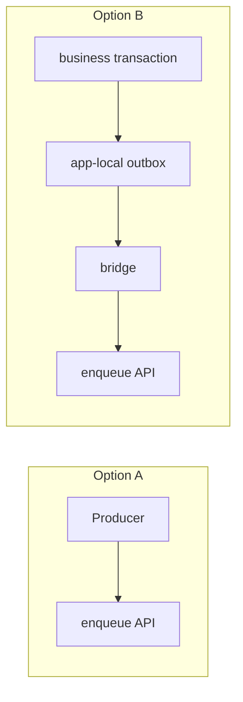

# Application integration

[Documentation](../README.md) › [Guides](README.md) › **Integration**

workhold has its own PostgreSQL — that is the service store, not the client database. An application does not have to have its own business database.

Two working ways to enqueue tasks. Both use the same `POST /v1/queues/{queue_name}/tasks` from OpenAPI.

> **There is no distributed transaction** between the application's business database and workhold PostgreSQL.

## Option A: DB-less

An application without a business store does not introduce its own client database: the queue lives in workhold PostgreSQL.

1. Admin created a named queue.
2. The producer (or the SDK) enqueues with `Idempotency-Key`.
3. Worker claim / complete — see [03-worker-claim-complete.md](03-worker-claim-complete.md).
4. When needed, Delivery Outbox `events[]` is sent through role `relay`.

This fits the use case “enqueue work and process it on competing replicas” without a local outbox.

## Option B: app-local outbox bridge

If the application already has a business database and needs to “commit a business fact and enqueue a task” without a blind double write:

1. In the **same** application transaction, write the business row and the app-local outbox row (the outbox schema is **owned by the application**; workhold does not dictate it).
2. After commit, a separate bridge process reads the outbox and performs an idempotent enqueue into workhold (`Idempotency-Key` / bridge identity).
3. workhold reports success only after its own commit; the bridge marks the outbox row as delivered.

workhold does not take part in the application transaction. The application outbox bridge does not promise exactly-once external effects — only repeatable delivery of intent → enqueue.

Do not invent reserved payload keys or outbox DDL “on behalf of workhold”: the bridge contract lives in the `workhold-producer` package (`workhold_producer.bridge`, extra `bridge-postgres`); see [05-app-outbox-bridge.md](05-app-outbox-bridge.md).

## What to choose

| Is there a business database? | Need an atomic “fact + task”? | Path |
| --- | --- | --- |
| No | — | DB-less direct enqueue |
| Yes | No (the task can be enqueued separately) | Direct enqueue |
| Yes | Yes | App-local outbox + bridge |

## Next

- Enqueue steps: [02-producer-enqueue.md](02-producer-enqueue.md)
- Meaning: [how-it-works.md](../01-concepts/03-how-it-works.md), [transactional-outbox.md](../01-concepts/10-transactional-outbox.md)
- FAQ about the application database: [application-db.md](../06-faq/04-application-db.md)

---

← [Guides](README.md) · [Producer enqueue](02-producer-enqueue.md) →
