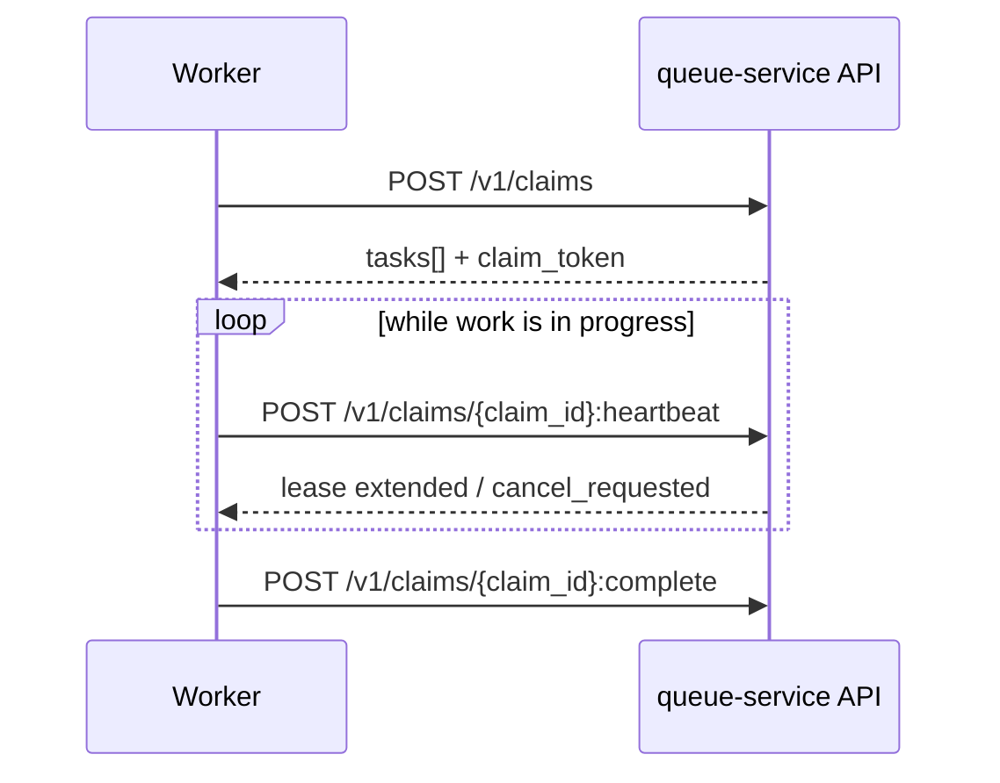

# Worker: claim, heartbeat, complete

[Documentation](../README.md) › [Guides](README.md) › **Worker**

How a worker claims a task, extends the lease, and finishes the claim.
Paths are colon-form from the current OpenAPI. The `claim_token` secret stays only in
the `X-Queue-Claim-Token` header, never in a URL or query.

## Install (`queue-service-consumer`)

```bash
pip install queue-service-consumer
pip install "queue-service-consumer[async]"   # optional httpx
```

```python
from queue_service_consumer import ConsumerClient, ConsumerSupervisor
from _queue_service_client_core.transport import HttpJsonTransport

client = ConsumerClient(
    HttpJsonTransport("https://queue.example"),
    bearer_token=worker_secret,  # WORKER only — never producer/admin
)
```

Async: `AsyncConsumerClient` / `AsyncConsumerSupervisor` from
`queue_service_consumer.async_client` / `async_supervisor` with
`HttpxAsyncTransport` after installing `[async]`. Long-poll budgets, TLS and
capability guards: [06-client-sdk-ergonomics.md](06-client-sdk-ergonomics.md).

## 1. Claim

`POST /v1/claims`

MVP: `max_tasks=1`. Bounded long polling: `wait_seconds` ∈ `0..20`
(capability `long_polling=true`, `max_wait_seconds=20`). `worker_id` —
a diagnostic replica id (for example `<worker>`). A zero wait is an immediate
claim; a positive wait waits for wake/fallback until expiry. An empty expiry is
`tasks: []` (success), not a timeout.

```bash
curl -sS -X POST "https://queue.example/v1/claims" \
  -H "Authorization: Bearer <secret>" \
  -H "Content-Type: application/json" \
  -d '{
    "queues": ["orders"],
    "max_tasks": 1,
    "lease_seconds": 60,
    "wait_seconds": 0,
    "worker_id": "<worker>"
  }'
```

The response **always** contains a `tasks` array, even when there is no work:

```json
{
  "tasks": [],
  "server_time": "…",
  "recommended_heartbeat_seconds": 20,
  "queue_states": {}
}
```

An empty claim is `tasks: []`, not HTTP 204.

Each issued task in `claim` has a public `claim_id` and a secret
`claim_token`. Lease-operation paths carry only `claim_id`.

## Claim order among due tasks

Among **eligible** rows (due by queue-service-store time, or expired lease reclaim) the selector orders candidates: **`priority` DESC**, then **`available_at` ASC**, then **`id` ASC**. Due eligibility is before static priority; the due gate always runs first. `priority` is a strict integer. Non-preemption: a task with a future `available_at` or an unexpired lease does not compete and is not preempted by a later enqueue with a higher numeric priority. Replay keeps source `priority`.

Expired leased rows take part in the same tuple ordering; under a constant stream of higher-priority due work, a low `priority` can **starve** — this is the expected behavior of static priority without fairness/aging. Do not use destructive cleanup or truncate.

Details: [concurrency](../04-architecture/02-concurrency.md).

## 2. Heartbeat

`POST /v1/claims/{claim_id}:heartbeat`

Extend the lease until `lease_expires_at`, using
`recommended_heartbeat_seconds` (with jitter) as a guide.

Substitute the public `claim_id` and the secret `claim_token` from the claim response:

```bash
curl -sS -X POST \
  "https://queue.example/v1/claims/{claim_id}:heartbeat" \
  -H "Authorization: Bearer <secret>" \
  -H "X-Queue-Claim-Token: CLAIM_TOKEN_FROM_RESPONSE" \
  -H "Content-Type: application/json" \
  -d '{}'
```

On heartbeat, watch `cancel_requested`: if true, finish
cooperatively via `ack_cancel`, rather than via a normal complete.



## 3. Complete

`POST /v1/claims/{claim_id}:complete`

In one response, queue-service records terminal success and optionally `spawn[]`
tasks. `events[]` Delivery Outbox is the accepted model
([12-delivery-outbox.md](../01-concepts/12-delivery-outbox.md)); public HTTP
does not accept the key yet (`delivery_events` is off). Repeating
the same claim with the same body is idempotent.

```bash
curl -sS -X POST \
  "https://queue.example/v1/claims/{claim_id}:complete" \
  -H "Authorization: Bearer <secret>" \
  -H "X-Queue-Claim-Token: CLAIM_TOKEN_FROM_RESPONSE" \
  -H "Content-Type: application/json" \
  -d '{"spawn":[]}'
```

## 4. Fail

`POST /v1/claims/{claim_id}:fail`

Pass a machine-readable `failure_code`. Named queue policy decides
retry or dead letter. Do not put business error text in queue-service.

## 5. ack_cancel

`POST /v1/claims/{claim_id}:ack-cancel`

When cancellation has already been requested (by the producer or admin) and the lease is still yours —
confirm the cancellation with an idempotent `ack_cancel`. Do not mix it with complete.

## Lease loss

If heartbeat / complete / fail returned `lease_lost` (or the equivalent from the
error model): **stop** queue-service mutations with this token. The external effect
may already have happened — the handler must be idempotent (at-least-once).

## Next

- Producer: [02-producer-enqueue.md](02-producer-enqueue.md)
- Follow-up / spawn: [follow-up.md](../01-concepts/05-follow-up.md)
- Delivery Outbox / two recipients: [12-delivery-outbox.md](../01-concepts/12-delivery-outbox.md)
- `claim_id` vs `claim_token`: [claim-id-vs-claim-token.md](../06-faq/12-claim-id-vs-claim-token.md)
- Protocol: [client-protocol.md](../04-architecture/09-client-protocol.md)
