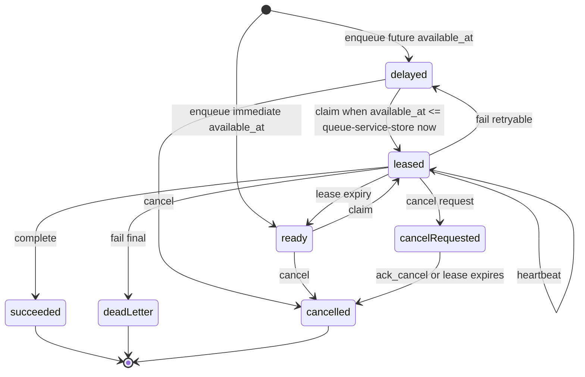
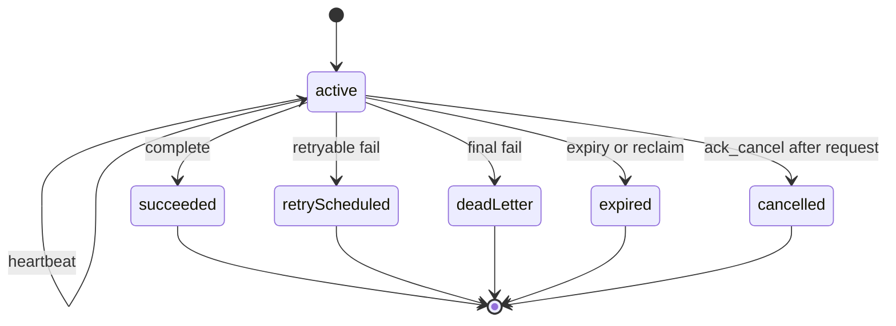
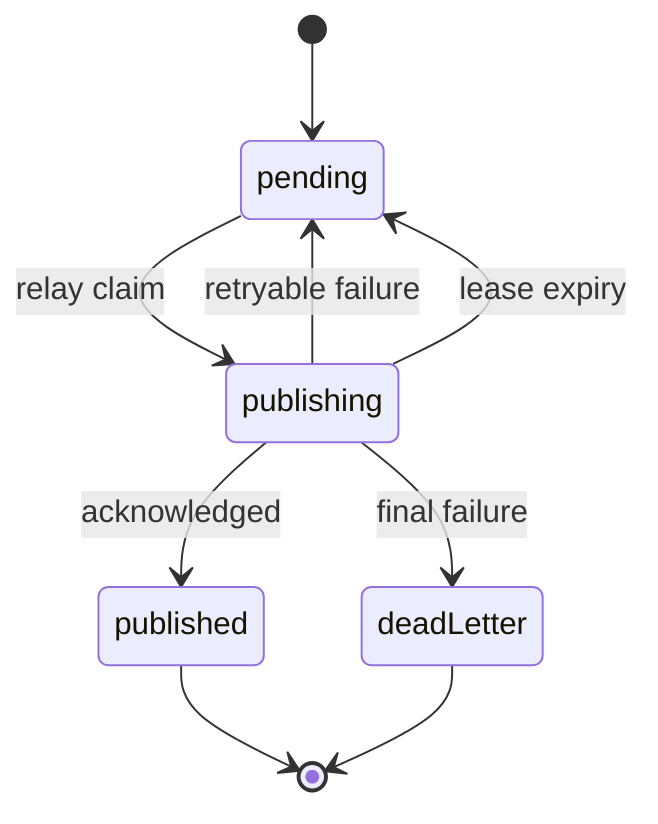

# State machines

These are logical product states. Exact enum names and table layouts
belong to later API and storage contracts.

## Task

### State definitions

| State | Meaning |
| --- | --- |
| Delayed | Not claimable until `available_at` (queue-service-store time) |
| Ready | Claimable: `available_at <= transaction_timestamp()` |
| Leased | Held by one current claim until expiry |
| Succeeded | Terminal successful complete |
| Dead-lettered | Terminal non-retryable or exhausted work |
| Cancelled | Terminal cancellation that won the race with complete |

Each task carries `priority` and `available_at`. `priority` is a signed `smallint` default `0`, inclusive `-32768`…`32767`; among due candidates a higher number means higher claim priority. Scheduling is a **one-shot** bounded future `available_at`:
omitted/null/past/current → immediate (`ready`); an aware future within
`QUEUE_SCHEDULE_HORIZON_SECONDS` (default/max **86400**, range **0..86400**)
→ `delayed` until the time is reached.

**There is no promotion job or intermediate "delayed→ready" transition.** When
queue-service-store time reaches `available_at`, claim moves `delayed` **directly**
to `leased` (or `ready` → `leased` for immediate work). The same applies to
retry-scheduled work: a retryable fail/expiry records `delayed` with a future
`available_at`; after the time is reached, claim selects the row without a separate
daemon.

### Transition rules

- Claim creates a new attempt and rotates the claim token.
- Claim records queue-service-store `claimed_at` and a diagnostic `worker_id` on
  the current lease and the append-only attempt.
- Due claim: `state_code IN (delayed, ready) AND available_at <= transaction_timestamp()`.
  Counter: `delayed→leased` decrements `delayed_count`, increments `leased_count`;
  `ready→leased` decrements `ready_count`, increments `leased_count`.
- Heartbeat never changes task identity or the attempt number.
- Lease expiry closes the current attempt as expired and allows a later
  claim.
- A retryable fail records a structured failure code, closes the attempt,
  and assigns a future availability time from the named queue retry policy (state
  `delayed`, not a separate promotion).
- Each task stores the retry policy version selected at enqueue. Configuration
  changes apply to new tasks unless there is an explicit administrative
  migration.
- When retry is disabled, a worker failure or lease expiry moves directly to
  dead-lettered after the attempt is recorded.
- Complete, final fail, and cancellation are terminal and mutually exclusive.
- Complete may atomically create spawns and delivery events.
- Cancel of a delayed or ready task is immediately terminal.
- Cancel of a leased task persists `cancel requested`; heartbeat surfaces it, and
  the worker acknowledges it with the dedicated terminal `ack_cancel`.
- If a lease with cancel requested expires, queue-service cancels the task instead of issuing
  another processing lease.
- Cancellation never creates spawns or delivery events.
- A terminal transition cannot be reversed in place. Replay creates an auditable new
  task or operation.

### Explicitly out of scope

- cron / calendar recurrence;
- per-task retry override;
- Delivery Outbox event scheduling;
- a promotion daemon or a separate physical "promoted" state.

## Claim and attempt

A claim is an ephemeral authority token. An attempt is retained history. Repeating the same
claim token and request after a committed terminal transition is an idempotent
replay, not another transition.

## Delivery event

Task claims and relay claims are different resources. A task can be succeeded while
its event is still pending; that is the point of the Delivery Outbox. Scheduling `events[]`
is outside WORK-15.

## Race winners

| Race | Winner |
| --- | --- |
| Heartbeat vs reclaim | The transaction that first validates and locks the current lease |
| Complete vs lease expiry/reclaim | Complete only if the same claim is still current and unexpired |
| Complete vs cancel request | Complete wins only if it validates before the cancellation is recorded; otherwise reject |
| Duplicate complete | The original body/result; a different body is an idempotency conflict |
| Relay publish vs lease loss | Publication may be duplicated; acknowledgement is written only by the current relay claim |
