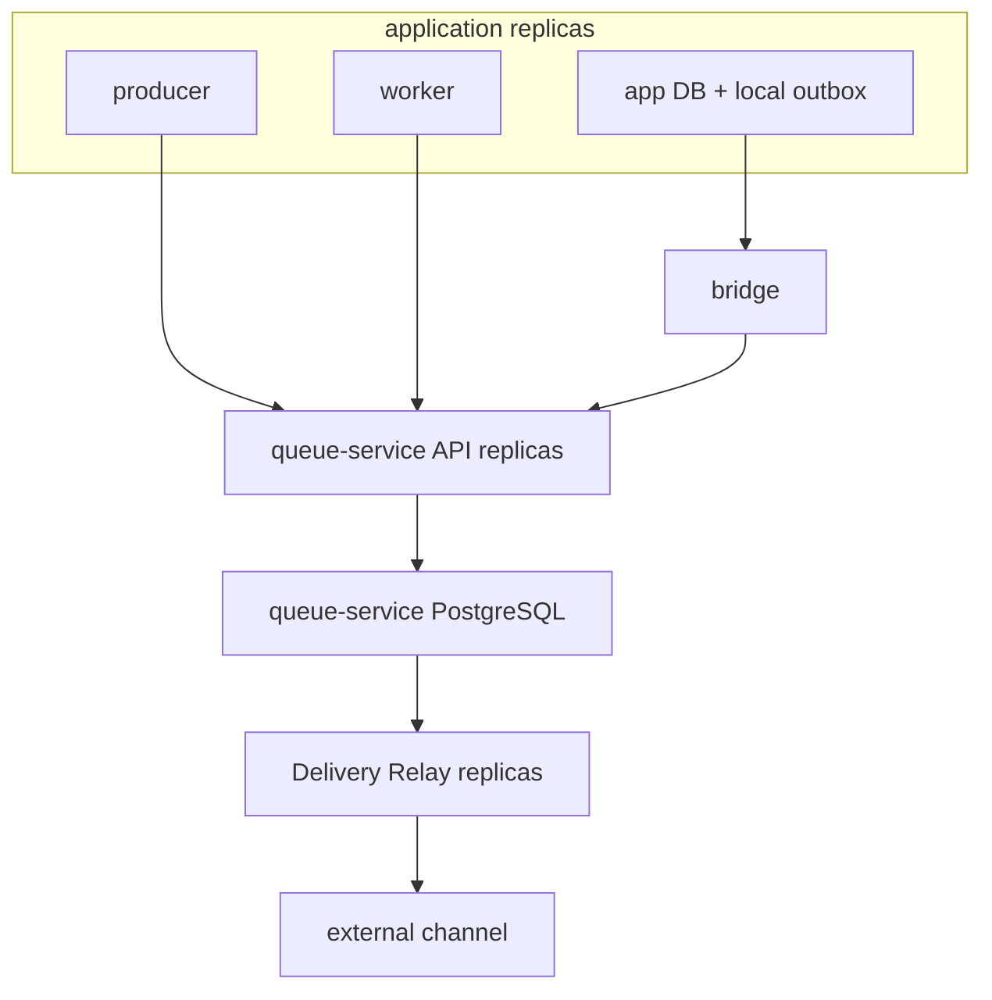
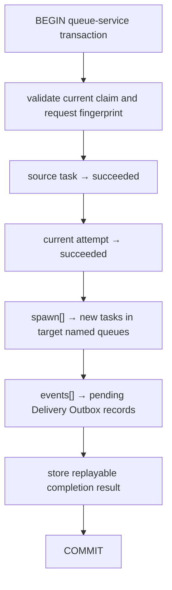
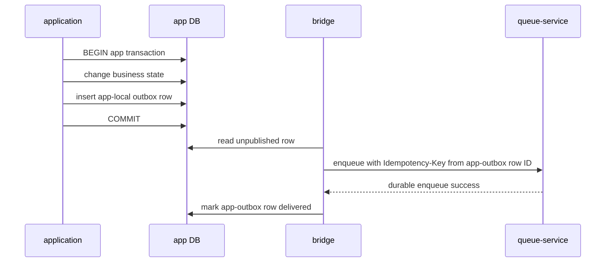

# Data flow

## Components

One queue-service instance and its store belong to one application trust boundary.
Named queues route work inside that boundary. `app DB + local outbox`
on the diagram is an optional path: queue-service always has its own PostgreSQL,
and the application may have no database of its own (then only producer/worker → API remains).

## Direct enqueue

1. The producer selects a named queue and an idempotency key.
2. queue-service checks limits and the normalized request fingerprint.
3. queue-service inserts a task or returns the existing matching task.
4. Success is returned only after commit.

## Claim and processing

1. The worker requests work from the queues it supports.
2. queue-service atomically selects a claimable task and creates a fenced lease.
3. The worker performs application work outside queue-service transactions.
4. The worker heartbeats long-running work.
5. The worker completes, reports a retryable failure, or reports a final failure.

queue-service may redeliver after lease loss. Worker effects are therefore
idempotent.

## Atomic complete

After commit, spawns enter the work queue immediately. Events are durable intent and may
stay pending while the external destination is unavailable.

## Delivery event

1. The relay claims pending delivery events with its own lease.
2. The relay publishes a stable event ID and envelope to the configured channel.
3. The relay records the acknowledgement.
4. Uncertain or retryable outcomes are retried with backoff.
5. Permanent/exhausted events become delivery dead letters.

Delivery is at-least-once. The external consumer uses an inbox or equivalent
idempotency.

The relay is pluggable by transport. The first adapter is an HTTP webhook with an allowlisted
destination, a timeout, transient/permanent classification, exponential delivery
backoff, and a circuit breaker. Broker adapters do not change work queue storage.
Events use CloudEvents 1.0 JSON structured mode with a stable ID/time
assigned by queue-service.

## Application business DB bridge

This closes the loss window between the business commit and the enqueue intent without
a distributed transaction. queue-service does not own the application outbox schema.

## Statistics flow

Correctness transactions append attempts and update bounded
counters and events. The metrics exporter instruments transitions and latency.
The statistics interface reads a cheap snapshot projection with `as_of`; historical
analysis reads retained attempts or external time-series storage, never
arbitrary payload keys on the claim path. Concrete protocols and paths are
Phase 3 decisions.

## Deploy and upgrade

1. PostgreSQL becomes reachable.
2. The one-shot migration role updates the queue-service-owned schema.
3. API replicas pass readiness only on a compatible schema.
4. The relay starts after a valid destination configuration.
5. On shutdown the API stops accepting work and drains requests; workers
   stop claiming and either finish or let leases expire.
