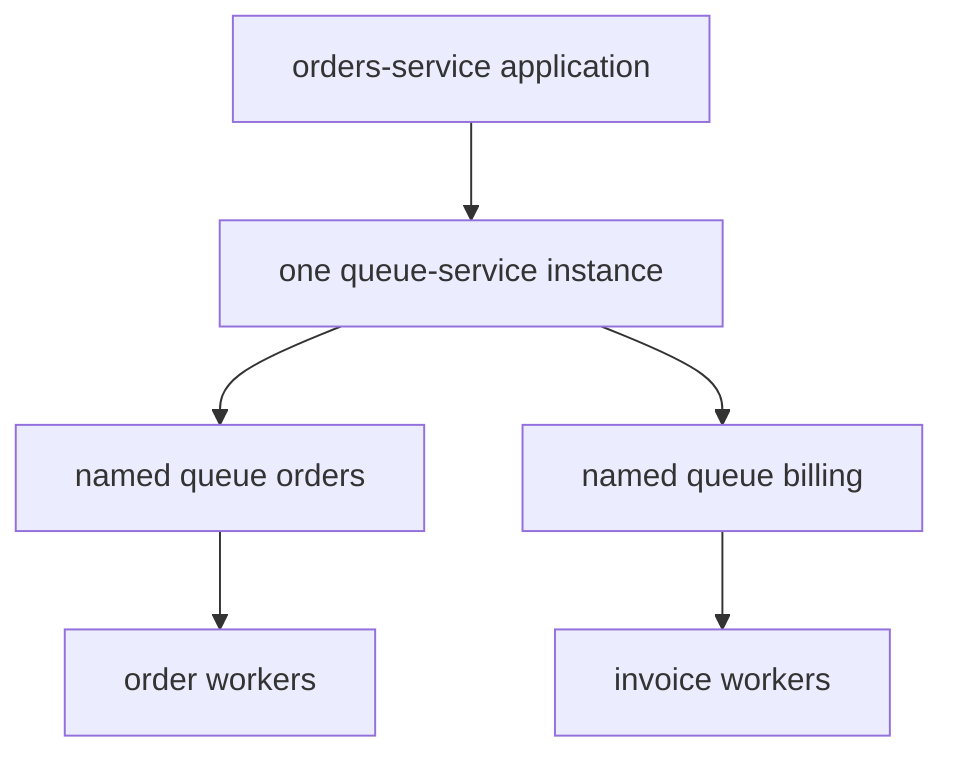

# What is a named queue?

[Documentation](../README.md) › [FAQ](README.md) › **Named queue**

**In short.** A named stream of tasks inside one queue-service instance.
The application has one deploy of the service; inside it, several queues with different
names (for example `orders` and `billing`). The producer writes a task to a specific
name. A worker claims only the queues it knows how to process.

## Why a name, and not a field in the payload

queue-service does not parse the payload as business meaning. If you route
by a field inside JSON, a worker that only knows billing can accidentally
take an order — and either crash or do someone else's work.

The queue name is explicit routing *before* the task is handed out. The worker of the
`orders` queue does not list `billing` in the claim and will not receive someone else's task.

You do not need a separate instance for each kind of work: that multiplies
PostgreSQL and operations. Kinds of work live as names inside one instance.

## What each queue has

Each named queue has its own retry policy and runtime state:

| State | Enqueue | Claim |
| --- | --- | --- |
| `active` | yes | yes |
| `paused` | yes, the backlog grows | an empty successful response — processing is stopped |
| `draining` | a new external enqueue — no | yes; internal `spawn[]` continues |

The idempotency key applies in the scope of producer + queue name + key.
The same key in `orders` and in `billing` is two different operations.

An admin creates the queue explicitly. Enqueue of an unknown name is an error, not
a silent new queue "from a typo".

## What a named queue is not

- not the whole queue-service and not "the platform queue";
- not a Kafka topic and not pub/sub: one task is taken by one logical worker
  (it may be handed out again after the lease is lost);
- not a separate instance and not its own database per name;
- not something that appears by itself on the first enqueue.

---

Create a queue: [admin-queues.md](../02-guides/04-admin-queues.md).
A typo in the name: [11-missing-named-queue.md](11-missing-named-queue.md).
