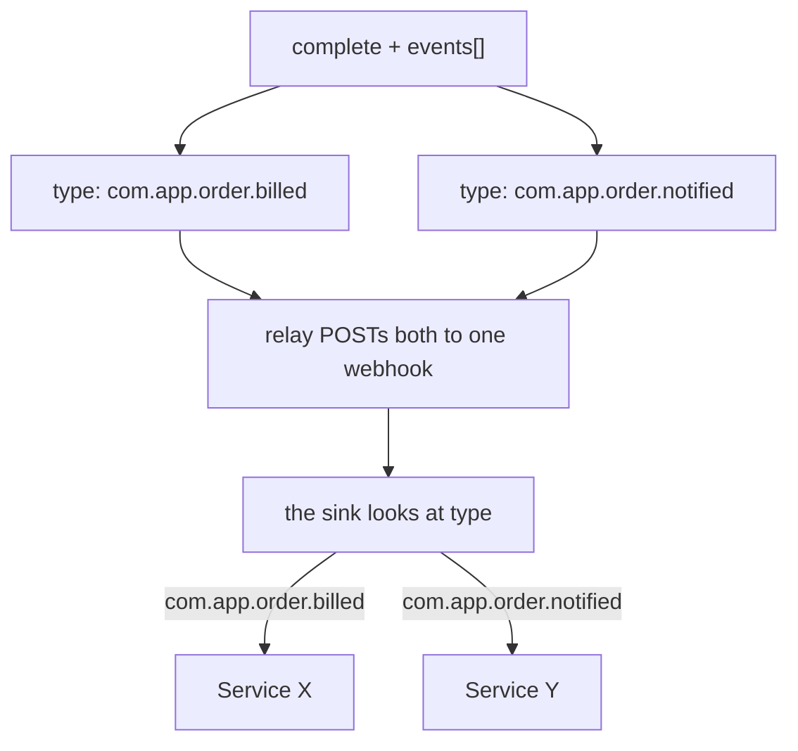
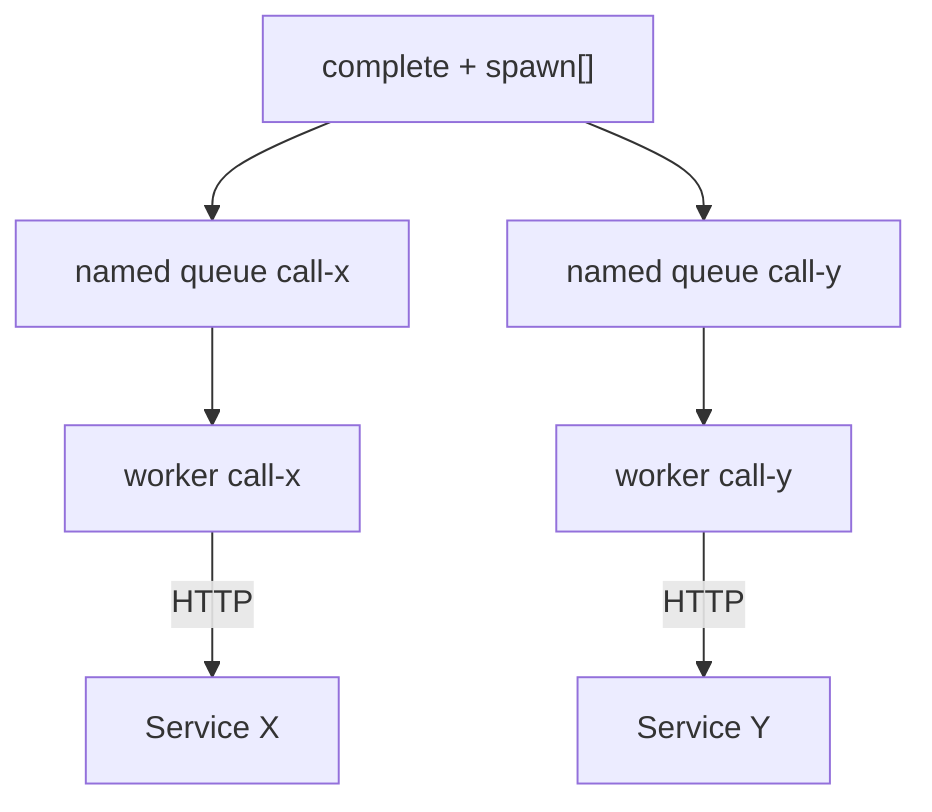

# How do you send one event to service X and another to Y?

[Documentation](../README.md) › [FAQ](README.md) › **two recipients**

**In short.** The relay does not route by address. Both events go to
**one** webhook of the deploy. Where it goes next is up to you: either the sink looks at
`type` and calls X or Y, or these are not events but `spawn[]` into two
named queues. You cannot put the URL of X or Y into an event — that is not supported
and it would be SSRF.

## First decide what you actually need

"Send to X and to Y" sounds like the same thing, but these are two different jobs.

| What you actually need | This is | Where to put it |
| --- | --- | --- |
| X and Y must *learn* that the step finished | notifications | `events[]` with a different `type` |
| Someone must *call* X and Y, with retries like those of tasks | work | `spawn[]` into two queues, or the current worker inside the lease |

The Delivery Outbox is a log of outbound notifications. The `relay` role publishes
them after commit. It is not an HTTP proxy and not an address book.

## These are notifications: "X and Y must learn"

Put two CloudEvents into `events[]`, with a **different** `type` (and their own `data`).
Each event has its own `id`, which workhold assigns. The inbox at X
and the inbox at Y are independent: a retry of one event does not count as a retry of the other.

The webhook is your thin sink or an API gateway. It is not part of the queue image.
It is the one that knows `com.app.order.billed` goes to X. The queue
does not know that, and must not know that.

Why one webhook: where to send is set by the deploy operator
(`QUEUE_DELIVERY_WEBHOOK_URL` plus an allowlist of hosts and CIDRs), not by the worker and
not by the event body. Otherwise the task itself chooses the address — that is SSRF.

### One event to both is usually worse

You can publish one event and ask the sink to fan it out both to X
and to Y. Then X and Y have **the same** `id`. If they deduplicate
on that id, that is fine only when "already processed" means one and
the same thing. If billing and the notifier must survive a retry independently
(one applied it, the other did not), make two events with two `id` values.

### Two queue deploys are not the answer

Do not stand up a second workhold instance "so that each one has its own
webhook". An instance belongs to one trust boundary of the application. Two
instances are already two products, or a forbidden attempt to make a bus.

## This is work: "must call X and call Y"

Do not use the Delivery Outbox as a proxy. The relay does not hold a lease
on the business call, does not write your `failure_code`, and does not retry like a worker.

| You need | How |
| --- | --- |
| The current worker itself calls X and Y | business HTTP inside the lease; complete without `events[]`, or only with a "done" notification |
| The calls must survive this worker crashing | `spawn[]` into two named queues whose workers call X and Y |

The admin creates the target queues in advance. A typo in `queue_name`
is a complete error; the queue does not appear "by itself".

You can mix them: `spawn[]` means call X, and `events[]` means tell
the notifier that the call happened. In one complete transaction these are different
resources.

While the worker holds the lease, the external HTTP calls to X and Y are its own. If it died
after the call to X and before complete, another worker calls Y (or the same worker
after reclaim). Both calls must be idempotent.

## What the contract does not have — and why people reach for it

| What you want | Why you cannot |
| --- | --- |
| A `url` / `host` / `header` field on the event | The task chooses the address → SSRF |
| Several webhooks on one instance, with routing by content | The deploy sets one channel; the meaning is in `type` |
| Exactly-once delivery to X or Y | Publication is at-least-once: publish may have succeeded, the ack may not. An inbox at the consumer |
| "The relay calls X like a worker" | Then the Outbox becomes a second claim/ack core |

Public HTTP complete does not accept `events[]` yet: the capability
`delivery_events` = false, and the key is reserved. The model is already this;
turning the field on in the API is a separate step. Right now the path "two recipients as
work" is `spawn[]` or HTTP from the current worker.

## Common mistakes

| Mistake | What happens |
| --- | --- |
| Put the URL of X into `data` and wait for the relay to call it | The relay hits the deploy webhook. Nobody reads a URL in `data` as an address |
| Two events with one `type`, "tell them apart by data" | The sink gets more complicated; a different `type` is better |
| A spawn into X "in order to notify" | You get a full task with a lease and retry. To "learn", an event is enough |
| An event "in order to charge the money reliably" | The relay does not retry like a task. A charge is a worker or a spawn |

---

The CloudEvents contract and the relay role: [12-delivery-outbox.md](../01-concepts/12-delivery-outbox.md).
How spawn differs from an event: [09-spawn-vs-events.md](09-spawn-vs-events.md).
