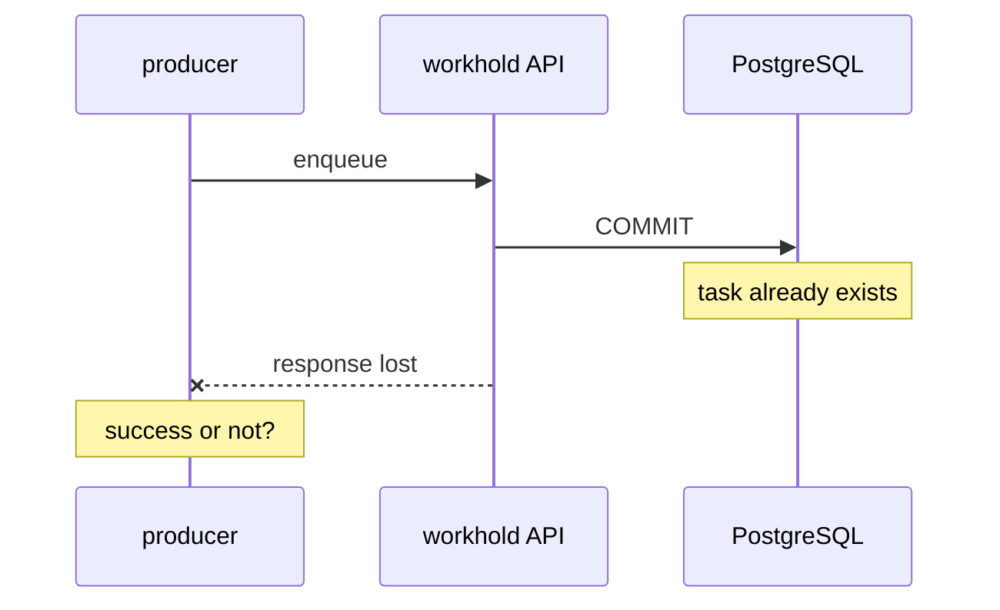

# Enqueue response lost after commit

[Documentation](../README.md) › [Troubleshooting](README.md) › **Enqueue response lost**

**What you see.** The client sent an enqueue, the connection dropped, a timeout,
a pod restart, a 502 on the proxy. It is unclear whether the task was created.
A retry "just in case" is risky: there might be a second one.

**This is not a bug.** A successful enqueue responds only after the commit in
workhold PostgreSQL. The commit may have landed, and the HTTP response
may not. The task is already there.

## Why

Two separate things: the write to the store and the response to the client.
Between them the API process can die, the network can drop, or the client
timeout can fire before the body is read.

If the queue answered *before* the commit, you would treat the task as
accepted when it did not exist. So the commit is first, the response second.
The price is "response lost, the task is alive".

## What to do

1. Retry the enqueue with the **same** idempotency key and the **same**
   normalized body (the same named queue, payload, priority,
   available_at — everything that is part of the fingerprint).
2. workhold finds the existing record and returns the original task.
   A second piece of work does not appear.
3. Then work with this id as if the first response had arrived.

The producer must send a stable key for any operation the client
may retry (timeout, HTTP client retry, job restart). Without a key
a retry is already a second enqueue.

If the application has a business database, the same key must be derived
from the app-local outbox: the bridge simply retries the enqueue. Otherwise,
after "response lost" you will not remember which key you enqueued with.

## What not to do

| Do not | Why |
| --- | --- |
| Change the payload on a "retry" and keep the same key | That is a fingerprint conflict, not a replay. See [02](02-idempotency-key-conflict.md) |
| Generate a new key "to be sure" | You get a second task |
| Treat a timeout as proof that the task does not exist | The commit may have landed |
| Poll the admin UI instead of retrying with the same key | A retry is the normal protocol |

## How to tell it is fine

The retry returned the same task (the same identifier) expected from
the first call. Workers will see it. There is no new row with the same
meaning in the queue.
