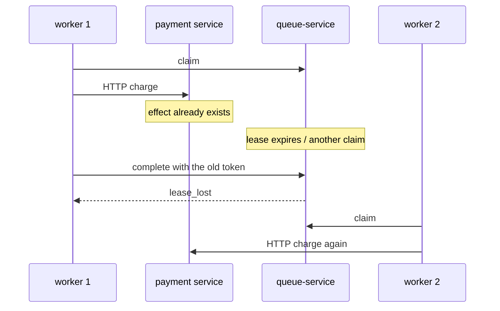

# External side effect already done, then the lease is lost

[Documentation](../README.md) › [Troubleshooting](README.md) › **Side effect + lease_lost**

**What you see.** The worker called the outside world (charged money, stored a
file, called an API), then complete/heartbeat returned `lease_lost`. A minute
later another worker takes the same task and is about to call out again.

**This is not a queue-service bug.** queue-service guarantees at-least-once
delivery of the task, not an exactly-once external effect. The effect happened
*outside* the store transaction.

## Why

The order in time:

queue-service does not take part in the call to X and does not fence it.
`claim_token` protects rows in queue-service PostgreSQL. The other service
does not know your token.

Complete atomically closes the task and writes spawn/events, but that happens
*after* the effect. If complete was not recorded, the work is unfinished for
queue-service — it will be handed out again.

Typical reasons the lease is lost after the effect: a long external call
without a heartbeat, the call timed out, a pod restart between HTTP and
complete, the network to the queue-service API.

## What to do

Make the handler idempotent *before* this happens in production.
Options:

- **Inbox** at the owner of the effect: in one transaction, "this task/attempt
  id is already applied" plus the state change. A retry skips the effect.
- **Idempotency key of the external API** (`Idempotency-Key: order-42-charge`).
  The second call returns the original result, not a second charge.
- **Compare-and-set** in your own store: charge only if the status is still
  `pending`.

After `lease_lost`:

1. Do not try to push complete through with the old token.
2. Do not try to roll back the external effect "because queue-service did not
   accept it" — another worker may already be on the same path.
3. Rely on idempotency. The new attempt either sees "already done" and
   completes immediately, or safely repeats the call.

If there is no idempotency, this is an application incident: a double charge
is possible. queue-service is uninvolved, and the lease cannot be fixed
after the fact.

## What not to do

| Do not | Why |
| --- | --- |
| Treat the token as a fence around the outside world | It is not one |
| Do the effect, then think about idempotency | Too late: the second worker is already on the way |
| Put a unique index "in the queue on the payload" | queue-service does not interpret business meaning |
| After `lease_lost`, send a compensating HTTP "undo the charge" | A race with the new worker |

Why there is no exactly-once: [05-exactly-once.md](../06-faq/05-exactly-once.md).
How the inbox works: [11-inbox.md](../01-concepts/11-inbox.md).
