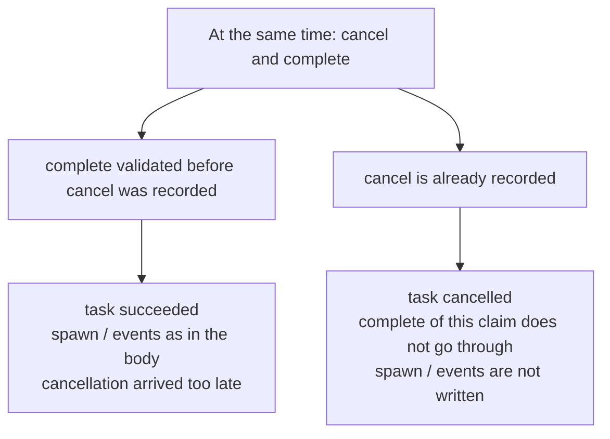

# Cancel and complete race

[Documentation](../README.md) › [Troubleshooting](README.md) › **Cancel vs complete**

**What you see.** The producer requested cancellation while the worker sends
complete (or the other way around). One of the calls loses: `cancel_race_lost`,
or complete does not go through. Either the task is cancelled and you were
waiting for spawn. Or it is succeeded and you were waiting for the
cancellation to catch up.

**There is a documented winner.** Complete wins only if it validates *before*
the cancellation is recorded. Otherwise complete loses (`cancel_race_lost`).
Cancellation never creates `spawn[]` or `events[]`.

## How cancellation works

| Task state | What cancel does |
| --- | --- |
| delayed / ready (not yet leased) | Immediately terminal cancelled |
| leased | A cancellation request is recorded; heartbeat shows it to the worker |
| leased, the worker confirms | Idempotent `ack_cancel` of the current claim |
| leased, the worker died | Lease expiry with cancellation already requested → cancelled, not a new claim |

On heartbeat the worker sees that cancellation was requested and must stop
cooperatively: do not start a new external effect, and confirm `ack_cancel`.
queue-service does not kill the process itself.

The race is who was recorded first:

A retry of the same terminal command with the same body returns the original
winner. A retry with a *different* body cannot overturn the outcome.

## What to do

1. Respect the terminal winner. Do not send the opposite command "to fix it".
2. The next piece of work after cancellation is a separate new enqueue (a new
   key), not spawn from the complete that lost.
3. Worker: on a heartbeat that carries cancel, send `ack_cancel`, not complete
   "I almost finished". If the effect already went outside, use idempotency
   plus compensation in the application; queue-service will not spawn from a
   cancellation.
4. Producer: delayed/ready is cancelled immediately; for leased, wait for the
   ack or for expiry. An HTTP cancel is not an instant stop of the external
   effect.

## What not to do

| Do not | Why |
| --- | --- |
| Retry complete with a different body after cancel | The outcome is already recorded |
| Wait for `events[]` from a cancelled task | Cancel does not create them |
| Treat cancel as an exactly-once stop of the worker's HTTP call | The effect may already have gone out |
| Confuse `ack_cancel` with fail | Fail is a processing failure and retry/dead letter; cancel withdraws the work |

Why there is no exactly-once effect: [05-exactly-once.md](../06-faq/05-exactly-once.md).
