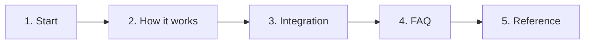

# Workhold - Durable work queue

Workhold is a durable Work Queue next to the application, not a platform-wide bus.

Reading order is section order, then file numbers. Product semantics and architecture decisions are accepted; the physical API, storage, and operations are derived from them phase by phase.

## Start

| Who you are | Open |
| --- | --- |
| Application developer | [Reading path ≈15 minutes](00-onboarding/01-reading-path.md) |
| Integrator | [First integration](02-guides/01-integrate-application.md) |
| Architect / reviewer | [Product boundary](01-concepts/07-product-boundary.md) → [architecture](04-architecture/README.md) |
| Operator | [Operations](05-operations/README.md) |
| Contributor | [CONTRIBUTING.md](../CONTRIBUTING.md) |

Product overview: [01-concepts/01-overview.md](01-concepts/01-overview.md).

## How it works

End-to-end lifecycle: [03-how-it-works.md](01-concepts/03-how-it-works.md).

## First integration

[First integration](02-guides/01-integrate-application.md).

## FAQ

[06-faq](06-faq/README.md) — one question, one file.

## Reference

Commands, schema, and architecture contracts: [03-reference](03-reference/01-commands.md), [04-architecture](04-architecture/README.md).

## Section map

| Section | Contents |
| --- | --- |
| [00-onboarding](00-onboarding/01-reading-path.md) | [Reading path](00-onboarding/01-reading-path.md), [local setup](00-onboarding/02-local-setup.md) |
| [01-concepts](01-concepts/README.md) | Why the service exists, lifecycle, named queues, spawn, Delivery Outbox, boundary, guarantees, outbox/inbox |
| [02-guides](02-guides/README.md) | How-to: integration, producer, worker, admin, [client SDK](02-guides/06-client-sdk-ergonomics.md) |
| [03-reference](03-reference/01-commands.md) | Commands and env; [storage contract](03-reference/02-storage-contract.md) — live schema catalog. Old [formats](03-reference/03-formats.md), [storage](03-reference/04-storage.md), [HTTP](03-reference/05-http-api.md) — superseded proposals |
| [04-architecture](04-architecture/README.md) | State machines, concurrency, [storage topology](04-architecture/04-storage-topology.md), data flow, [ADR](04-architecture/adr/README.md) |
| [05-operations](05-operations/README.md) | Security, deployment/recovery, observability, admin tools |
| [06-faq](06-faq/README.md) | One question, one file |
| [07-troubleshooting](07-troubleshooting/README.md) | One symptom, one file |
| [08-examples](08-examples/README.md) | Application usage scenarios |
| [_ai](_ai/README.md) | Memory Bank for AI agents |

## Key pages

| Topic | Page |
| --- | --- |
| End-to-end lifecycle | [03-how-it-works.md](01-concepts/03-how-it-works.md) |
| How this differs from a broker | [02-why-queue.md](01-concepts/02-why-queue.md) |
| What the product promises | [07-product-boundary.md](01-concepts/07-product-boundary.md), [09-guarantees.md](01-concepts/09-guarantees.md) |

The root [README.md](../README.md) is the repository landing page.
